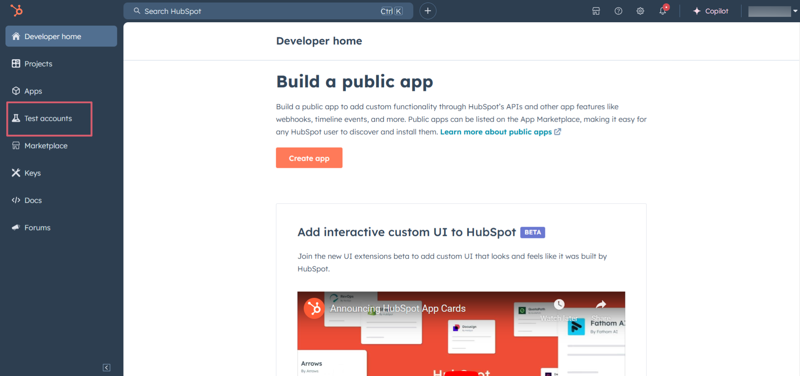
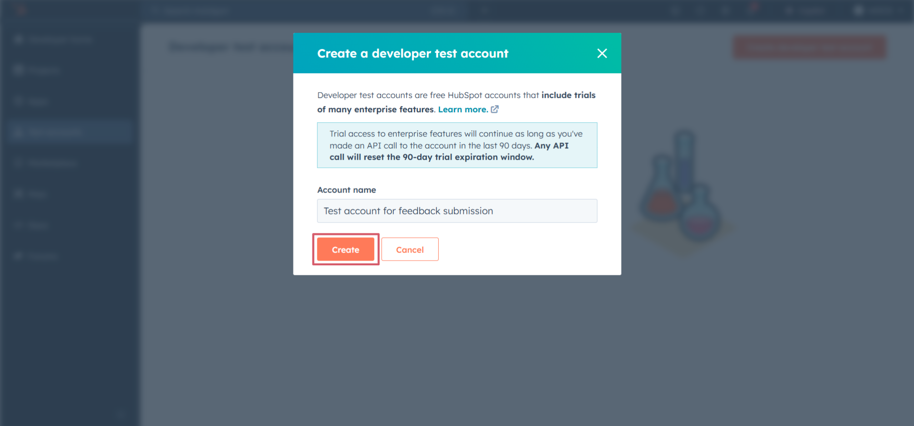
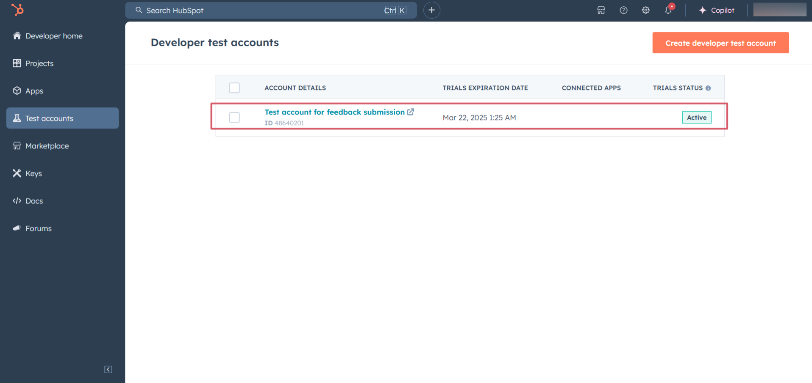
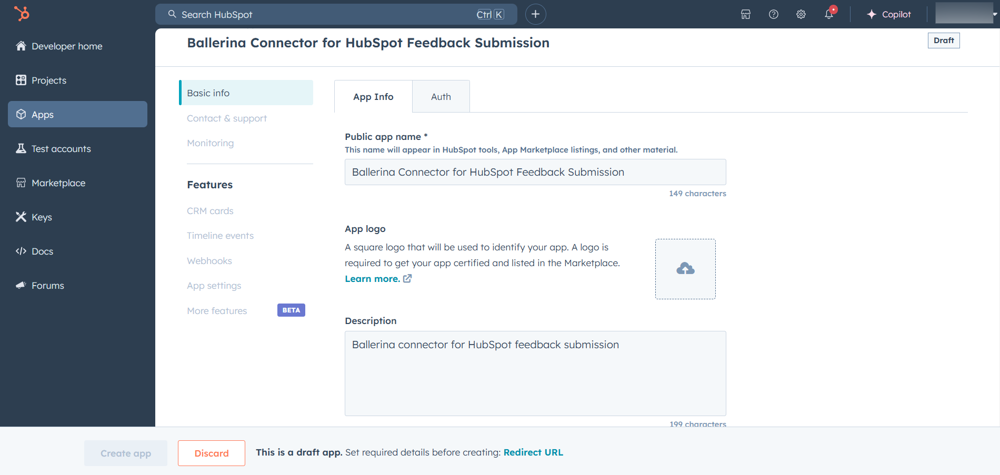
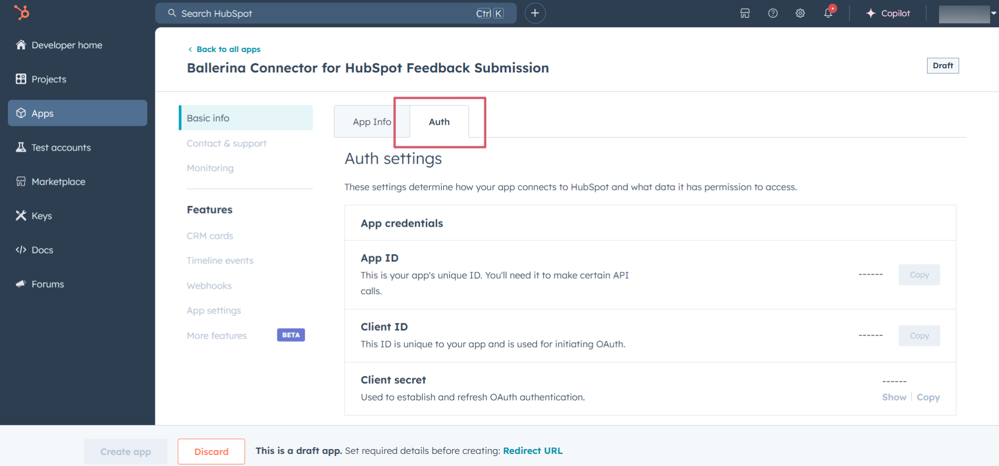
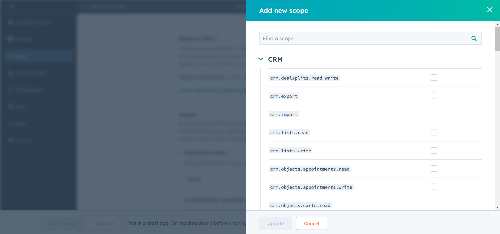
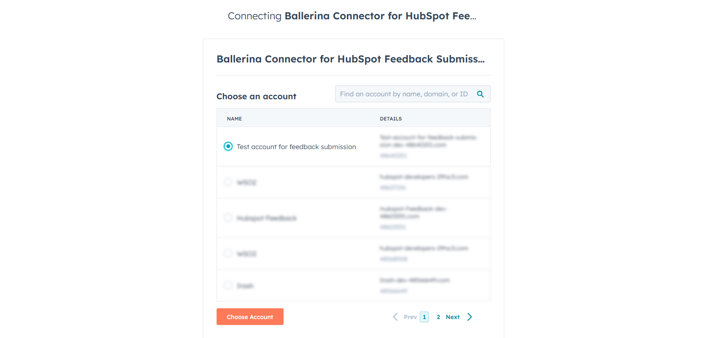

## Overview

[HubSpot](https://developers.hubspot.com/docs/reference/api) is an AI-powered customer relationship management (CRM) platform. 

The `ballerinax/hubspot.crm.object.feedback` offers APIs to connect and interact with the [HubSpot Feedback Submission API](https://developers.hubspot.com/docs/reference/api/crm/objects/feedback-submissions) endpoints, specifically based on the [HubSpot API v3](https://developers.hubspot.com/docs/reference/api).

> **_NOTE:_**
> This package may be changed in the future based on the HubSpot API changes, since it is currently under development and is subject to change based on testing and feedback. By using this package, you are agreeing to accept any future changes that might occur and understand the risk associated with testing an unstable API.
> Refer to the [HubSpot Developer Terms](https://legal.hubspot.com/developer-terms?_gl=1*fmuxuh*_ga*NDU4NDIxOTA5LjE3MzQ3ODM3Mjg.*_ga_LXTM6CQ0XK*MTczNDgwNjI1OS4yLjAuMTczNDgwNjI1OS42MC4wLjA.&_ga=2.66923502.174841559.1734639641-983296813.1734639641) & [Developer Beta Terms](https://legal.hubspot.com/developerbetaterms?_gl=1*fmuxuh*_ga*NDU4NDIxOTA5LjE3MzQ3ODM3Mjg.*_ga_LXTM6CQ0XK*MTczNDgwNjI1OS4yLjAuMTczNDgwNjI1OS42MC4wLjA.&_ga=2.66923502.174841559.1734639641-983296813.1734639641) for more information.
>
> The feedback submissions endpoints are currently read only. Feedback submissions cannot be submitted or edited through the API. But following endpoints are available to view feedback submissions.
>
> ```
> GET https://api.hubapi.com/crm/v3/objects/feedback_submissions
> GET https://api.hubapi.com/crm/v3/objects/feedback_submissions/{feedbackSubmissionId}
> POST https://api.hubapi.com/crm/v3/objects/feedback_submissions/batch/read
> POST https://api.hubapi.com/crm/v3/objects/feedback_submissions/search
> ```

## Setup guide

To use the HubSpot Feedback connector, you must have access to the HubSpot API through a HubSpot developer account and a HubSpot App under it. Therefore you need to register for a developer account at HubSpot if you don't have one already.

### Step 1: Create/Login to a HubSpot Developer Account

If you have an account already, go to the [HubSpot developer portal](https://app.hubspot.com/)

If you don't have a HubSpot Developer Account you can sign up to a free account [here](https://developers.hubspot.com/get-started)

### Step 2 (Optional): Create a [Developer Test Account](https://developers.hubspot.com/beta-docs/getting-started/account-types#developer-test-accounts) under your account

Within app developer accounts, you can create developer test accounts to test apps and integrations without affecting any real HubSpot data.

**_These accounts are only for development and testing purposes. In production you should not use Developer Test Accounts._**

1. Go to Test accounts section from the left sidebar.

   
2. Click on the `Create developer test account` button on the top right corner.

   
3. In the pop-up window, provide a name for the test account and click on the `Create` button.

   
4. You will see the newly created test account in the list of test accounts.

   

### Step 3: Create a HubSpot App

1. Now navigate to the `Apps` section from the left sidebar and click on the `Create app` button on the top right corner.

   
2. Provide a public app name and description for your app.

   

### Step 4: Setup Authentication

1. Move to the `Auth` tab.

   
2. In the `Scopes` section, add the following scopes for your app using the `Add new scopes` button.

   

   - `e-commerce`
   - `tickets`
   - `crm.objects.goals.read`
   - `media_bridge.read`
   - `crm.objects.custom.read`
   - `crm.objects.custom.write`
   - `crm.objects.feedback_submissions.read`

   

3. In the `Redirect URL` section, add the redirect URL for your app. This is the URL where the user will be redirected after the authentication process. You can use localhost for testing purposes. Then hit the `Create App` button.


### Step 5: Get the Client ID and Client Secret

Navigate to the `Auth` tab and you will see the `Client ID` and `Client Secret` for your app. Make sure to save these values.


### Step 6: Setup Authentication Flow

Before proceeding with the Quickstart, ensure you have obtained the Access Token using the following steps:

1. Create an authorization URL using the following format:

   ```
   https://app.hubspot.com/oauth/authorize?client_id=<YOUR_CLIENT_ID>&scope=<YOUR_SCOPES>&redirect_uri=<YOUR_REDIRECT_URI>
   ```

   Replace the `<YOUR_CLIENT_ID>`, `<YOUR_REDIRECT_URI>` and `<YOUR_SCOPES>` with your specific value.
2. Paste it in the browser and select your developer test account to intall the app when prompted.

   
3. A code will be displayed in the browser. Copy the code.

   ```
   Received code: na1-129d-860c-xxxx-xxxx-xxxxxxxxxxxx
   ```
4. Run the following curl command. Replace the `<YOUR_CLIENT_ID>`, `<YOUR_REDIRECT_URI`> and `<YOUR_CLIENT_SECRET>` with your specific value. Use the code you received in the above step 3 as the `<CODE>`.

   - Linux/macOS

     ```bash
     curl --request POST \
     --url https://api.hubapi.com/oauth/v1/token \
     --header 'content-type: application/x-www-form-urlencoded' \
     --data 'grant_type=authorization_code&code=<CODE>&redirect_uri=<YOUR_REDIRECT_URI>&client_id=<YOUR_CLIENT_ID>&client_secret=<YOUR_CLIENT_SECRET>'
     ```
   - Windows

     ```bash
     curl --request POST ^
     --url https://api.hubapi.com/oauth/v1/token ^
     --header 'content-type: application/x-www-form-urlencoded' ^
     --data 'grant_type=authorization_code&code=<CODE>&redirect_uri=<YOUR_REDIRECT_URI>&client_id=<YOUR_CLIENT_ID>&client_secret=<YOUR_CLIENT_SECRET>'
     ```

   This command will return the access token necessary for API calls.

   ```json
   {
     "token_type": "bearer",
     "refresh_token": "<Refresh Token>",
     "access_token": "<Access Token>",
     "expires_in": 1800
   }
   ```
5. Store the access token securely for use in your application.

## Quickstart

To use the `Hubspot CRM Feedback Submission` connector in your Ballerina project, follow the steps below and update the `.bal` file as follows.:

### Step 1: Import the Hubspot CRM Feedback Submission module

Import the `ballerinax/hubspot.crm.obj.feedback` module into your Ballerina project.

```
import ballerinax/hubspot.crm.obj.feedback;
```

### Step 2: Provide the required configurations

Create a `Config.toml` file where your `.bal` file is located and provide the following configurations:

```
clientId = "<CLIENT_ID>"
clientSecret = "<CLIENT_SECRET>"
refreshToken = "<REFRESH_TOKEN>"
```

### Step 3: Initialize the Hubspot CRM Feedback Submission Client

Initialize the Hubspot CRM Feedback Submission client by passing the configurations to the `main` function.

```
public function main() returns error?{
    feedback:ConnectionConfig config = {
        auth: {
            clientId: clientId,
            clientSecret: clientSecret,
            refreshToken: refreshToken,
            credentialBearer: oauth2:POST_BODY_BEARER
        }
    };

    final feedback:Client baseClient = check new feedback:Client(config, serviceUrl = "https://api.hubapi.com/crm/v3/objects"); 
}
```

### Step 4 (Optional): Invoke the Hubspot CRM Feedback Submission API (View Feedback Submissions)

You can view all feedback submissions by calling the `feedback_submissions` endpoint.

```
    feedback:CollectionResponseSimplePublicObjectWithAssociationsForwardPaging allFeedbackSubmissions = check baseClient->/feedback_submissions;
    io:println("All feedback submissions: ");
    io:println(allFeedbackSubmissions);
```

Refer more examples [here](./../examples/feedback_review/main.bal)

### Step 5: Run the Ballerina file

Use the following command to run the Ballerina file.

```
bal run
```

## Examples

The `HubSpot CRM Feedback` connector provides practical examples illustrating usage in various scenarios. Explore these [examples](https://github.com/module-ballerinax-hubspot.crm.object.feedback/tree/main/examples/), covering the following use cases:
